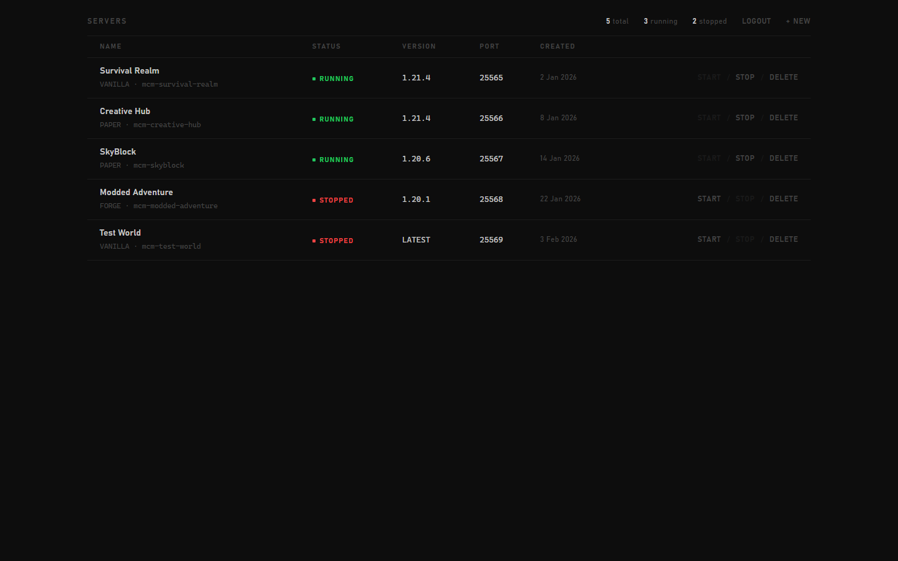
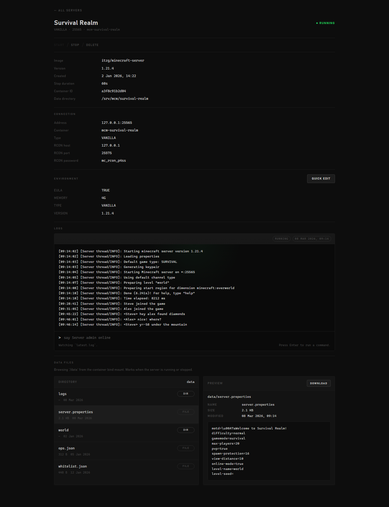
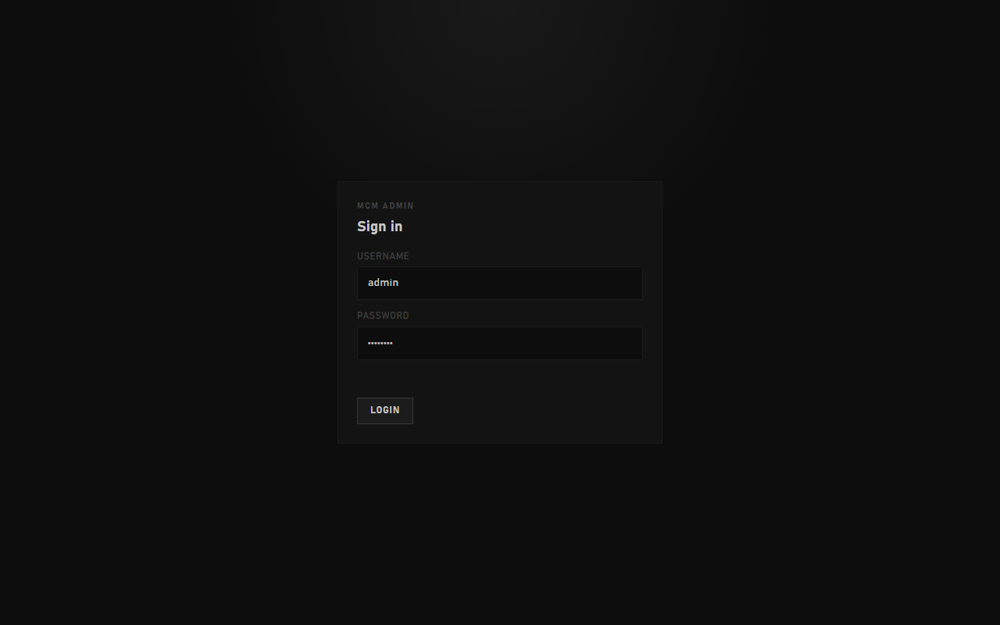

# MCM

MCM is a small web UI and API for managing Minecraft server containers through the host Docker daemon. It stores its own app data on disk, exposes a browser-based management interface, and avoids nested Docker by using the host `docker.sock`.

## Screenshots

**Dashboard — server list**



**Server detail — logs, environment, and file browser**



**Login**



## Requirements

- Linux server with Docker installed
- Access to `/var/run/docker.sock`
- `bash`
- `curl` for the one-command installer

## Quick Setup

Run the installer directly from GitHub:

```bash
curl -fsSL https://raw.githubusercontent.com/nanderq/mcm/master/setup.sh | bash
```

The script will prompt for:

- web UI port
- admin username
- admin password
- data directory, defaulting to the current directory

It will then:

- pull `nothing035/mcm:latest`
- generate the password hash automatically
- generate the session secret automatically
- replace any existing `mcm` container
- start the new container with the host Docker socket mounted

## Manual Setup

If you already have this repository on the server:

```bash
chmod +x ./setup.sh
./setup.sh
```

## Docker Image

The default deployment image is:

```bash
nothing035/mcm:latest
```

## Update To The Latest Version

Pull the newest image:

```bash
docker pull nothing035/mcm:latest
```

Then remove the old container and start it again with the same settings you used originally. If you deployed with `setup.sh`, the simplest option is to run it again:

```bash
curl -fsSL https://raw.githubusercontent.com/nothing035/mcm/master/setup.sh | bash
```

That will pull the latest image and recreate the `mcm` container for you.
